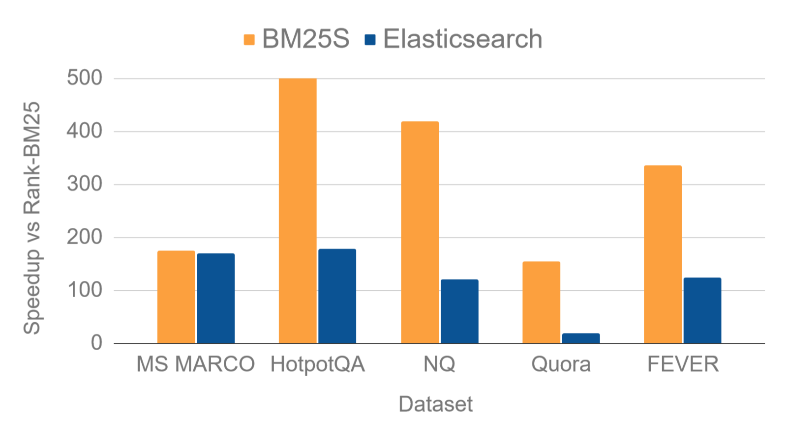

<div align="center">

<h1>BM25-Sparse⚡</h1>

<i>BM25S is an ultrafast implementation of BM25 in pure Python, powered by Scipy sparse matrices</i>

<table>
      <tr>
            <td>
                  <a href="https://github.com/xhluca/bm25s">💻 GitHub</a>
            </td>
            <td>
                  <a href="https://bm25s.github.io">🏠 Homepage</a>
            </td>
            <td>
                  <a href="https://arxiv.org/abs/2407.03618">📝 Technical Report</a>
            </td>
            <td>
                  <a href="https://huggingface.co/blog/xhluca/bm25s">🤗 Blog Post</a>
            </td>
            <td>
                  <a href="#installation">🛠️ Installation</a>
            </td>
      </tr>
</table>

</div>

Welcome to `bm25s`, a library that implements BM25 in Python, allowing you to rank documents based on a query. BM25 is a widely used ranking function used for text retrieval tasks, and is a core component of search services like Elasticsearch.

It is designed to be:
* **Fast**: `bm25s` is implemented in pure Python and leverage Scipy sparse matrices to store eagerly computed scores for all document tokens. This allows extremely fast scoring at query time, improving performance over popular libraries by orders of magnitude (see benchmarks below).
* **Simple**: `bm25s` is designed to be easy to use and understand. You can install it with pip and start using it in minutes. There is no dependencies on Java or Pytorch - all you need is Scipy and Numpy, and optional lightweight dependencies for stemming.

Below, we compare `bm25s` with Elasticsearch in terms of speedup over `rank-bm25`, the most popular Python implementation of BM25. We measure the throughput in queries per second (QPS) on a few popular datasets from [BEIR](https://github.com/beir-cellar/beir) in a single-threaded setting.



> [!IMPORTANT]
> New in version 0.2.0: We are rolling out support for a numba backend, which gives around [2x speedup for larger datasets](https://github.com/xhluca/bm25-benchmarks?tab=readme-ov-file#queries-per-second)! Learn more about it and share your thoughts in [the version 0.2.0 release thread](https://github.com/xhluca/bm25s/discussions/58).


<details open>
<summary>Show/Hide citation</summary><br>

```
@misc{bm25s,
      title={BM25S: Orders of magnitude faster lexical search via eager sparse scoring}, 
      author={Xing Han Lù},
      year={2024},
      eprint={2407.03618},
      archivePrefix={arXiv},
      primaryClass={cs.IR},
      url={https://arxiv.org/abs/2407.03618},
}
```

</details>

## Installation

You can install `bm25s` with pip:

```bash
pip install bm25s
```

If you want to use stemming for better results, you can install the recommended (but optional) dependencies:

```bash
# Install all extra dependencies
pip install bm25s[full]

# If you want to use stemming for better results, you can install a stemmer
pip install PyStemmer

# To speed up the top-k selection process, you can install `jax`
pip install jax[cpu]
```

## Quickstart

Here is a simple example of how to use `bm25s`:

```python
import bm25s
import Stemmer  # optional: for stemming

# Create your corpus here
corpus = [
    "a cat is a feline and likes to purr",
    "a dog is the human's best friend and loves to play",
    "a bird is a beautiful animal that can fly",
    "a fish is a creature that lives in water and swims",
]

# optional: create a stemmer
stemmer = Stemmer.Stemmer("english")

# Tokenize the corpus and only keep the ids (faster and saves memory)
corpus_tokens = bm25s.tokenize(corpus, stopwords="en", stemmer=stemmer)

# Create the BM25 model and index the corpus
retriever = bm25s.BM25()
retriever.index(corpus_tokens)

# Query the corpus
query = "does the fish purr like a cat?"
query_tokens = bm25s.tokenize(query, stemmer=stemmer)

# Get top-k results as a tuple of (doc ids, scores). Both are arrays of shape (n_queries, k).
# To return docs instead of IDs, set the `corpus=corpus` parameter.
results, scores = retriever.retrieve(query_tokens, k=2)

for i in range(results.shape[1]):
    doc, score = results[0, i], scores[0, i]
    print(f"Rank {i+1} (score: {score:.2f}): {doc}")

# You can save the arrays to a directory...
retriever.save("animal_index_bm25")

# You can save the corpus along with the model
retriever.save("animal_index_bm25", corpus=corpus)

# ...and load them when you need them
import bm25s
reloaded_retriever = bm25s.BM25.load("animal_index_bm25", load_corpus=True)
# set load_corpus=False if you don't need the corpus
```

For an example that shows how to quickly index a 2M-documents corpus (Natural Questions), check out [`examples/index_nq.py`](examples/index_nq.py).

## Flexibility

`bm25s` provides a flexible API that allows you to customize the BM25 model and the tokenization process. Here are some of the options you can use:

```python
# You can provide a list of queries instead of a single query
queries = ["What is a cat?", "is the bird a dog?"]

# Provide your own stopwords list if you don't like the default one
stopwords = ["a", "the"]

# For stemming, use any function that is callable on each word list
stemmer_fn = lambda lst: [word for word in lst]

# Tokenize the queries
query_token_ids = bm25s.tokenize(queries, stopwords=stopwords, stemmer=stemmer_fn)

# If you want the tokenizer to return strings instead of token ids, you can do this
query_token_strs = bm25s.tokenize(queries, return_ids=False)

# You can use a different corpus for retrieval, e.g., titles instead of full docs
titles = ["About Cat", "About Dog", "About Bird", "About Fish"]

# You can also choose to only return the documents and omit the scores
results = retriever.retrieve(query_token_ids, corpus=titles, k=2, return_as="documents")

# The documents are returned as a numpy array of shape (n_queries, k)
for i in range(results.shape[1]):
    print(f"Rank {i+1}: {results[0, i]}")
```

### Memory Efficient Retrieval

`bm25s` is designed to be memory efficient. You can use the `mmap` option to load the BM25 index as a memory-mapped file, which allows you to load the index without loading the full index into memory. This is useful when you have a large index and want to save memory:

```python
# Create a BM25 index
# ...

# let's say you have a large corpus
corpus = [
    "a very long document that is very long and has many words",
    "another long document that is long and has many words",
    # ...
]
# Save the BM25 index to a file
retriever.save("bm25s_very_big_index", corpus=corpus)

# Load the BM25 index as a memory-mapped file, which is memory efficient
# and reduce overhead of loading the full index into memory
retriever = bm25s.BM25.load("bm25s_very_big_index", mmap=True)
```

For an example of how to use retrieve using the `mmap=True` mode, check out [`examples/retrieve_nq.py`](examples/retrieve_nq.py).


## Tokenization

In addition to using the simple function `bm25s.tokenize`, you can also use the `Tokenizer` class to customize the tokenization process. This is useful when you want to use a different tokenizer, or when you want to use a different tokenization process for queries and documents:

```python
from bm25s.tokenization import Tokenizer

corpus = [
      "a cat is a feline and likes to purr",
      "a dog is the human's best friend and loves to play",
      "a bird is a beautiful animal that can fly",
      "a fish is a creature that lives in water and swims",
]

# Pick your favorite stemmer, and pass 
stemmer = None
stopwords = ["is"]
splitter = lambda x: x.split() # function or regex pattern
# Create a tokenizer
tokenizer = Tokenizer(
      stemmer=stemmer, stopwords=stopwords, splitter=splitter
)

corpus_tokens = tokenizer.tokenize(corpus)

# let's see what the tokens look like
print("tokens:", corpus_tokens)
print("vocab:", tokenizer.get_vocab_dict())

# note: the vocab dict will either be a dict of `word -> id` if you don't have a stemmer, and a dict of `stemmed word -> stem id` if you do.
# You can save the vocab. it's fine to use the same dir as your index if filename doesn't conflict
tokenizer.save_vocab(save_dir="bm25s_very_big_index")

# loading:
new_tokenizer = Tokenizer(stemmer=stemmer, stopwords=[], splitter=splitter)
new_tokenizer.load_vocab("bm25s_very_big_index")
print("vocab reloaded:", new_tokenizer.get_vocab_dict())

# the same can be done for stopwords
print("stopwords before reload:", new_tokenizer.stopwords)
tokenizer.save_stopwords(save_dir="bm25s_very_big_index")
new_tokenizer.load_stopwords("bm25s_very_big_index")
print("stopwords reloaded:", new_tokenizer.stopwords)
```

You can find advanced examples in [examples/tokenizer_class.py](examples/tokenizer_class.py), including how to:
* Pass a stemmer, stopwords, and splitter function/regex pattern
* Control whether vocabulary is updated by `tokenizer.tokenize` calls or not (by default, it will only be updated during the first call)
* Reset the tokenizer to its initial state with `tokenizer.reset_vocab()`
* Use the tokenizer in generator mode to save memory by `yield`ing one document at a time.
* Pass different outputs of the tokenizer to the `BM25.retrieve` function.


## Variants

You can use the following variants of BM25 in `bm25s` (see [Kamphuis et al. 2020](https://link.springer.com/chapter/10.1007/978-3-030-45442-5_4) for more details):

* Original implementation (`method="robertson"`) - we set `idf>=0` to avoid negatives
* ATIRE (`method="atire"`)
* BM25L (`method="bm25l"`)
* BM25+ (`method="bm25+"`)
* Lucene (`method="lucene"`)

By default, `bm25s` uses `method="lucene"`, which is Lucene's BM25 implementation (exact version). You can change the method by passing the `method` argument to the `BM25` constructor:

```python
# The IR book recommends default values of k1 between 1.2 and 2.0, and b=0.75
retriever = bm25s.BM25(method="robertson", k1=1.5, b=0.75)

# For BM25+, BM25L, you need a delta parameter (default is 0.5)
retriever = bm25s.BM25(method="bm25+", delta=1.5)

# You can also choose a different "method" for idf, while keeping the default for the rest
# for example, this is equivalent to rank-bm25 when `epsilon=0`
retriever = bm25s.BM25(method="atire", idf_method="robertson")
# and this is equivalent to bm25-pt
retriever = bm25s.BM25(method="atire", idf_method="lucene")
```

## Hugging Face Integration

`bm25` can naturally work with Hugging Face's `huggingface_hub`, allowing you to load and save to the model hub. This is useful for sharing BM25 indices and using community models. 

First, make sure you have a valid [access token for the Hugging Face model hub](https://huggingface.co/settings/tokens). This is needed to save models to the hub, or to load private models. Once you created it, you can add it to your environment variables (e.g. in your `.bashrc` or `.zshrc`):

```bash
export HUGGING_FACE_HUB_TOKEN="hf_..."
```

Now, let's install the `huggingface_hub` library:

```bash
pip install huggingface_hub
```

Let's see how to use `BM25SHF.save_to_hub` to save a BM25 index to the Hugging Face model hub:

```python
import os
import bm25s
from bm25s.hf import BM25HF

# Create a BM25 index
retriever = BM25HF()
# Create your corpus here
corpus = [
    "a cat is a feline and likes to purr",
    "a dog is the human's best friend and loves to play",
    "a bird is a beautiful animal that can fly",
    "a fish is a creature that lives in water and swims",
]
corpus_tokens = bm25s.tokenize(corpus)
retriever.index(corpus_tokens)

# Set your username and token
user = "your-username"
token = os.environ["HF_TOKEN"]
retriever.save_to_hub(f"{user}/bm25s-animals", token=token, corpus=corpus)
# You can also save it publicly with private=False
```

Then, you can use the following code to load a BM25 index from the Hugging Face model hub:

```python
import bm25s
from bm25s.hf import BM25HF

# Load a BM25 index from the Hugging Face model hub
user = "your-username"
retriever = BM25HF.load_from_hub(f"{user}/bm25s-animals")

# you can specify revision and load_corpus=True if needed
retriever = BM25HF.load_from_hub(
    f"{user}/bm25s-animals", revision="main", load_corpus=True
)

# if you want a low-memory usage, you can load as memory map with `mmap=True`
retriever = BM25HF.load_from_hub(
    f"{user}/bm25s-animals", load_corpus=True, mmap=True
)

# Query the corpus
query = "does the fish purr like a cat?"

# Tokenize the query
query_tokens = bm25s.tokenize(query)

# Get top-k results as a tuple of (doc ids, scores). Both are arrays of shape (n_queries, k)
results, scores = retriever.retrieve(query_tokens, k=2)
```

For a complete example, check out:
* [`examples/index_to_hf.py`](examples/index_to_hf.py) for indexing a corpus and upload to Huggingface Hub
* [`examples/retrieve_from_hf.py`](examples/retrieve_from_hf.py) for loading an index alongside corpus from Huggingface Hub and querying it.

## Comparison

Here are some benchmarks comparing `bm25s` to other popular BM25 implementations. We compare the following implementations:
* `bm25s`: Our implementation of BM25 in pure Python, powered by Scipy sparse matrices.
* `rank-bm25` (`Rank`): A popular Python implementation of BM25.
* `bm25_pt` (`PT`): A Pytorch implementation of BM25.
* `elasticsearch` (`ES`): Elasticsearch with BM25 configurations.

`OOM` means the implementation ran out of memory during the benchmark.

### Throughput (Queries per second)

We compare the throughput of the BM25 implementations on various datasets. The throughput is measured in queries per second (QPS), on a single-threaded Intel Xeon CPU @ 2.70GHz (found on Kaggle). For BM25S, we take the average of 10 runs. Instances exceeding 60 queries/s are in **bold**.

| Dataset          |       BM25S | Elastic |    BM25-PT |  Rank-BM25 |
| :--------------- | ----------: | ------: | ---------: | ---------: |
| arguana          |  **573.91** |   13.67 | **110.51** |          2 |
| climate-fever    |       13.09 |    4.02 |        OOM |       0.03 |
| cqadupstack      |  **170.91** |   13.38 |        OOM |       0.77 |
| dbpedia-entity   |       13.44 |   10.68 |        OOM |       0.11 |
| fever            |       20.19 |    7.45 |        OOM |       0.06 |
| fiqa             |  **507.03** |   16.96 |      20.52 |       4.46 |
| hotpotqa         |       20.88 |    7.11 |        OOM |       0.04 |
| msmarco          |        12.2 |   11.88 |        OOM |       0.07 |
| nfcorpus         | **1196.16** |   45.84 |     256.67 | **224.66** |
| nq               |       41.85 |   12.16 |        OOM |        0.1 |
| quora            |  **183.53** |    21.8 |       6.49 |       1.18 |
| scidocs          |  **767.05** |   17.93 |      41.34 |       9.01 |
| scifact          |  **952.92** |   20.81 |  **184.3** |       47.6 |
| trec-covid       |   **85.64** |    7.34 |       3.73 |       1.48 |
| webis-touche2020 |   **60.59** |   13.53 |        OOM |        1.1 |

More detailed benchmarks can be found in the [bm25-benchmarks repo](https://github.com/xhluca/bm25-benchmarks).

### Disk usage

`bm25s` is designed to be lightweight. This means the total disk usage of the package is minimal, as it only requires wheels for `numpy` (18MB), `scipy` (37MB), and the package itself is less than 100KB. After installation, the full virtual environment takes more space than `rank-bm25` but less than `pyserini` and `bm25_pt`:

| Package           | Disk Usage |
| ----------------- | ---------- |
| venv (no package) | 45MB       |
| `rank-bm25`       | 99MB       |
| `bm25s` (ours)    | 479MB      |
| `bm25_pt`         | 5346MB     |
| `pyserini`        | 6976MB     |
| `elastic`         | 1183MB     |

<details>
<summary>Show Details</summary>

The disk usage of the virtual environments is calculated using the following command:

```
$ du -s *env-* --block-size=1MB
6976    conda-env-pyserini
5346    venv-bm25-pt
479     venv-bm25s
45      venv-empty
99      venv-rank-bm25
```

For `pyserini`, we use the [recommended installation](https://github.com/castorini/pyserini/blob/master/docs/installation.md) with conda environment to account for Java dependencies.

</details>

### Optimized RAM usage

`bm25s` allows considerable memory saving through the use of *memory-mapping*, which allows the index to be stored on disk and loaded on demand. 

Using the `index_nq.py` to create an index, we can retrieve with:
* `examples/retrieve_nq.py`: setting `mmap=False` in the `main` function to load the index in memory, and `mmap=True` to load the index as a memory-mapped file. 
* `examples/retrieve_nq_with_batching.py`: This takes it a step further by batching the retrieval process, which allows for reloading the index after each batch (see *Mmap+Reload* below). This is useful when you have a large index and want to save memory.

We show the following results on the NQ dataset (2M+ documents, 100M+ tokens):

| Method        | Load Index (s) | Retrieval (s) | RAM post-index (GB) | RAM post-retrieve (GB) |
| ------------- | -------------- | ------------- | ------------------- | ---------------------- |
| In-memory     | 8.61           | 21.09         | 4.36                | 4.45                   |
| Memory-mapped | 0.53           | 20.22         | 0.49                | 2.16                   |
| Mmap+Reload   | 0.48           | 20.96         | 0.49                | 0.70                   |

We can see that memory-mapping the index allows for a significant reduction in memory usage, with comparable retrieval times. 

Similarly, for MSMARCO (8M+ documents, 300M+ tokens), we show the following results (running on the validation set), although the retrieval did not complete for the in-memory case:

| Method        | Load Index (s) | Retrieval (s) | RAM post-index (GB) | RAM post-retrieve (GB) |
| ------------- | -------------- | ------------- | ------------------- | ---------------------- |
| In-memory     | 25.71          | 93.66         | 10.21               | 10.34                  |
| Memory-mapped | 1.24           | 90.41         | 1.14                | 4.88                   |
| Mmap+Reload   | 1.17           | 97.89         | 1.14                | 1.38                   |

## Acknowledgement

* The central idea behind the scoring mechanism in this library is originally from [bm25_pt](https://github.com/jxmorris12/bm25_pt), which was a major inspiration to this project.
* The API of the [`BM25` class](https://github.com/xhluca/bm25s/blob/main/bm25s/__init__.py) is also heavily inspired by the design of BM25-pt, as well as that of rank-bm25.
* The multilingual stopwords are sourced from the [NLTK stopwords lists](https://github.com/nltk/nltk/blob/96ee715997e1c8d9148b6d8e1b32f412f31c7ff7/nltk/corpus/__init__.py#L315).
* The numba implementation are inspired by numba implementations originally proposed by [baguetter](https://github.com/mixedbread-ai/baguetter) and [retriv](https://github.com/AmenRa/retriv).
* The function `bm25s.utils.beir.evaluate` is taken from the [BEIR library](https://github.com/beir-cellar/beir). It follows the same license as the BEIR library, which is Apache 2.0.

## Citation

If you use `bm25s` in your work, please use the following bibtex:

```
@misc{bm25s,
      title={BM25S: Orders of magnitude faster lexical search via eager sparse scoring}, 
      author={Xing Han Lù},
      year={2024},
      eprint={2407.03618},
      archivePrefix={arXiv},
      primaryClass={cs.IR},
      url={https://arxiv.org/abs/2407.03618}, 
}
```
